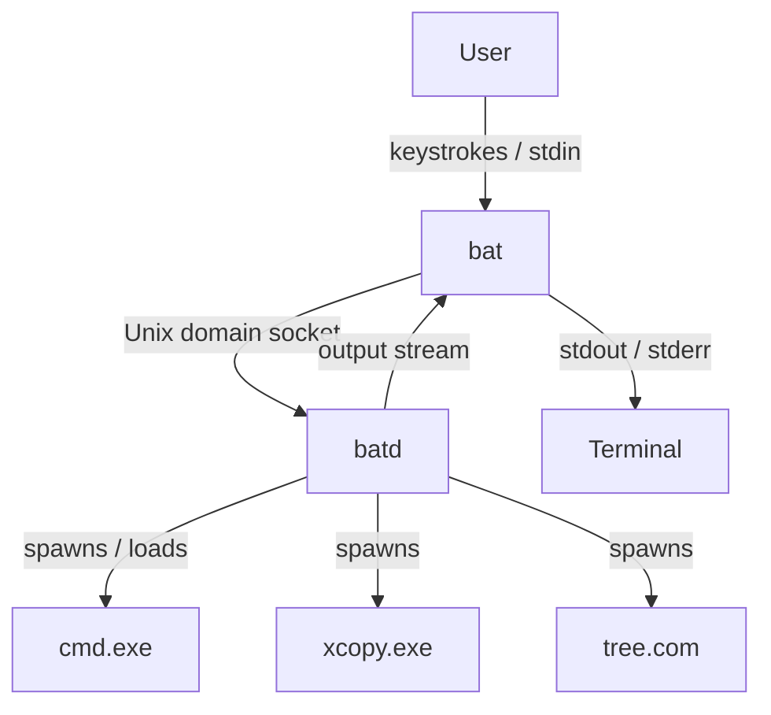
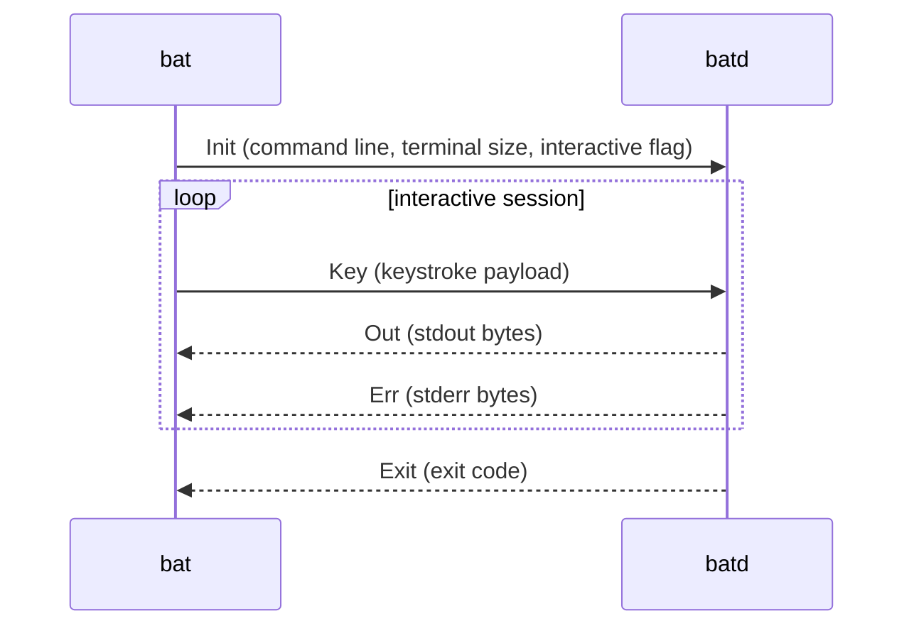
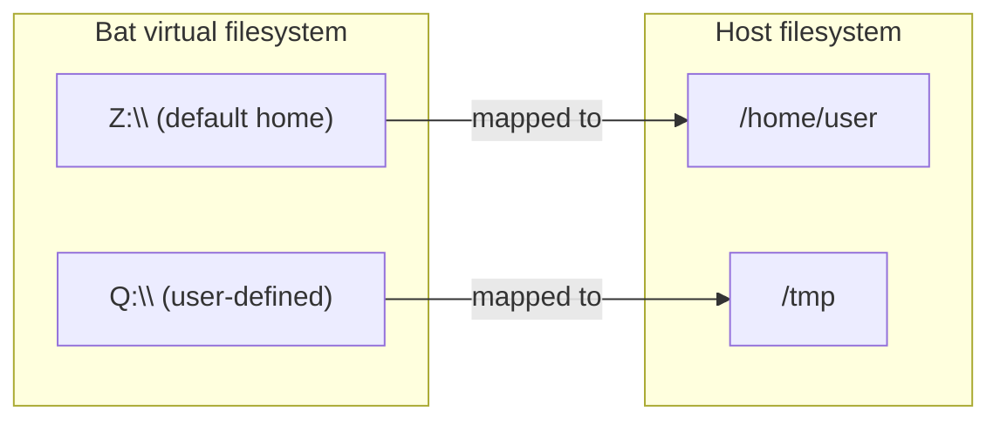
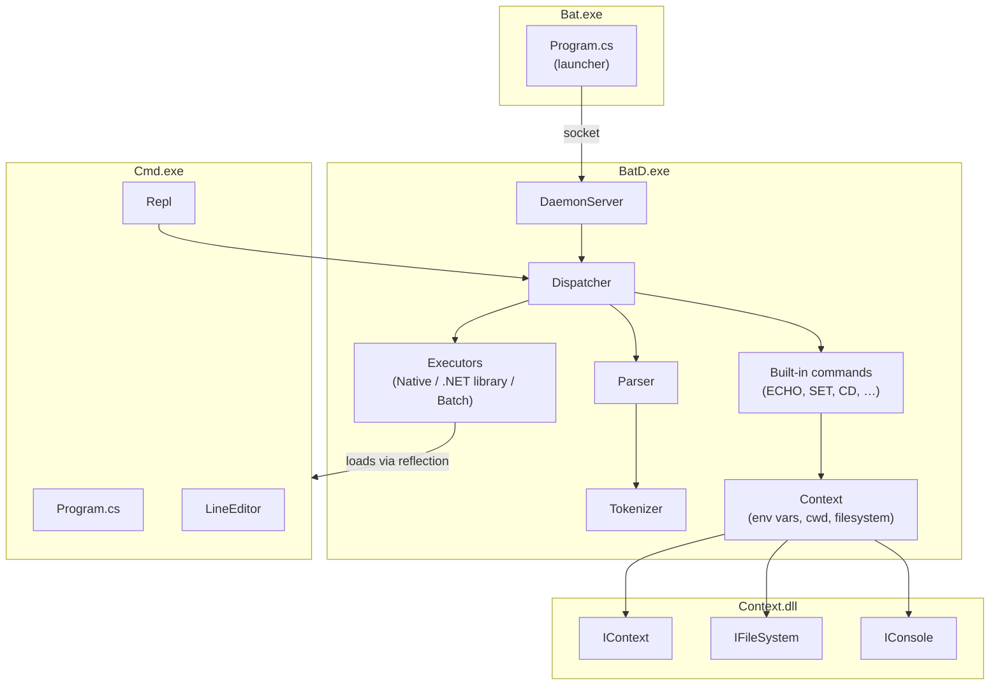
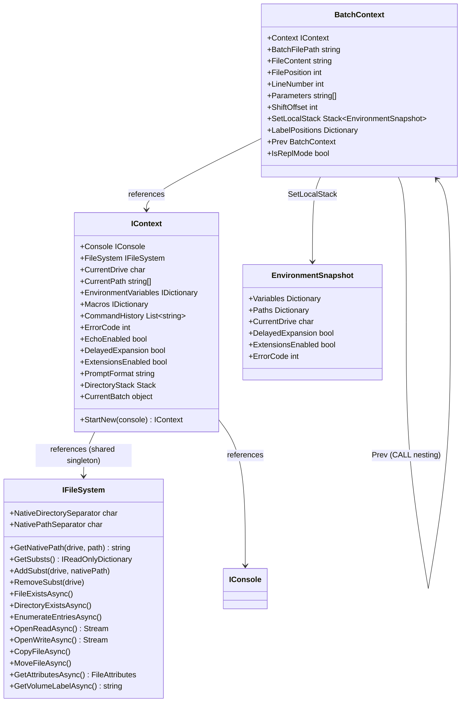
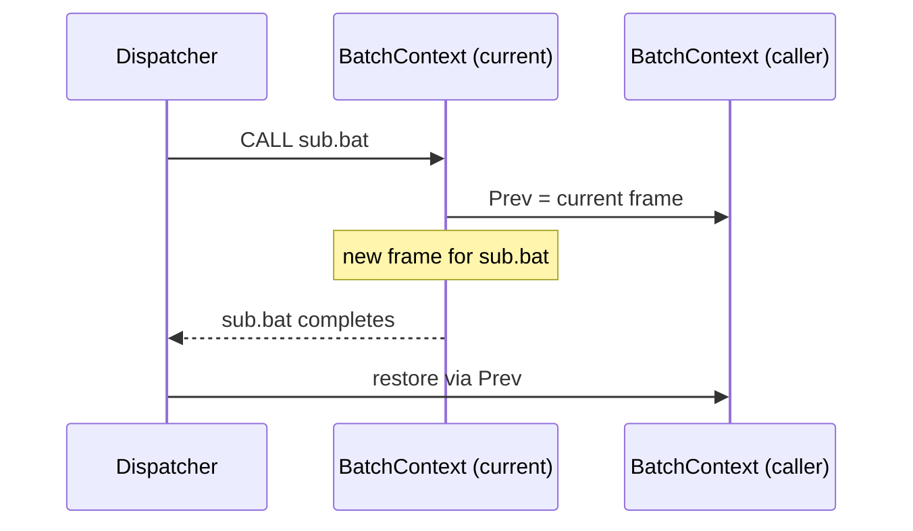
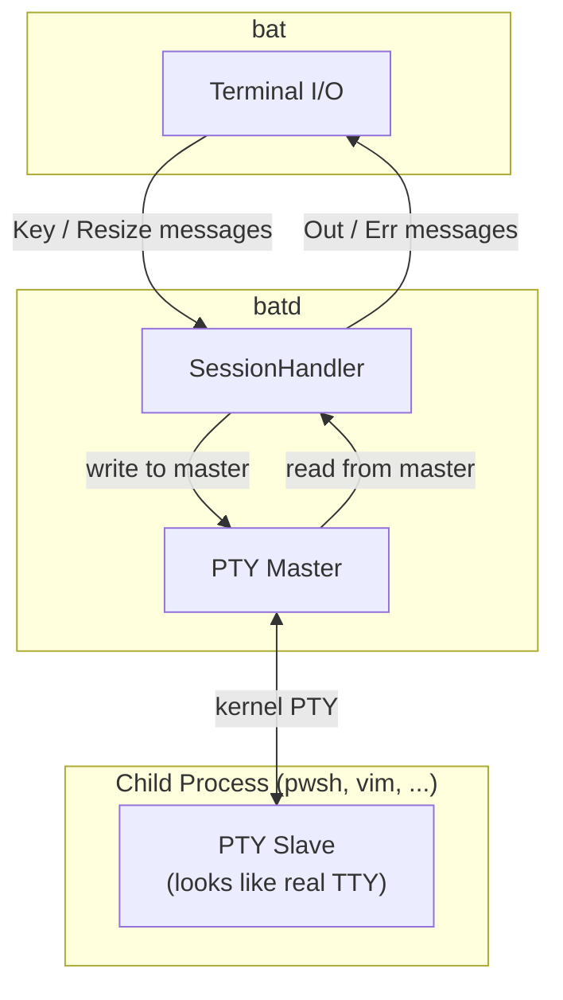

# Bat

## Goal

- A .NET implementation of `cmd.exe`
- Interactive command prompt and batch file executor, compatible with `cmd.exe`
- Cross-platform: Windows, Linux, macOS

Cross-platform support requires more than just `cmd.exe` compatibility:
- A line editor matching the behaviour of the Windows console (DOSKEY-style)
- Exposing the Linux/macOS filesystem in a DOS-style virtual drive layout

## Executables

Inside Bat, files carry the same names as their DOS/Windows counterparts:

| File | Role |
|---|---|
| `bat` / `bat.exe` | Entry point — launcher |
| `batd` / `batd.exe` | Daemon — shared state and execution engine |
| `cmd.exe` | Shell — REPL loop and tokenizer |
| `xcopy.exe` | External utility |
| `tree.com` | External utility |
| … | … |

No files other than these are required at runtime.

`cmd.exe`, `xcopy.exe`, `tree.com` and similar files are .NET assemblies (DLLs) with a 2 KB polyglot launcher stub prepended.
The stub is a carefully crafted binary that runs natively on Win16, Win32, Win64, Linux, and macOS (as a shell script).
When executed directly, it displays a user-friendly error message explaining that the file must be run through `batd`.
Because the satellite assemblies are standard .NET IL, they are inherently cross-platform — there is no emulation layer.
This is one of the key reasons for choosing .NET: a single binary works on every supported OS without recompilation.

> **Note**: the stub is currently 2 KB. It could theoretically be reduced to 1 KB, but this requires
> additional expertise in PE/ELF/Mach-O polyglot construction that has not yet been applied.

## Why `bat` and not `cmd.exe` as the entry point

- On Linux, we do not want to type `.exe` interactively, even though the filename must keep the extension for compatibility.
- `bat` accepts different startup parameters, including how the host filesystem maps onto the Bat virtual filesystem.
- `bat` follows the parameter conventions of the host OS.

## Architecture

### bat — launcher

`bat` is a lightweight launcher. Its only responsibilities are:

1. Start `batd` if it is not already running.
2. Connect to the daemon over a Unix domain socket.
3. Forward raw keystrokes (including special keys and key combinations) to the daemon.
4. Write output received from the daemon to the terminal.

Input is not a text stream. Keystrokes are forwarded as structured messages so that the line editor inside `batd` can handle them correctly.

`bat` is compiled with .NET Native AOT. This keeps the launcher binary small and fast to start — no JIT warmup, no large runtime embedded in the launcher itself. The .NET runtime lives inside `batd`, which is loaded only once.

### batd — daemon

`batd` is a singleton process that stays alive until explicitly shut down or the machine is turned off. It is **not** tied to the lifetime of any console window.

Responsibilities:

- **Shared state**: virtual filesystem mappings (`SUBST` drives) shared across all connected sessions.
- **Per-session state**: environment variables, current directory, echo flag, etc.
- **Dispatcher**: parses and executes commands, spawns native processes and .NET library executables.
- **Execution engine**: hosts the .NET runtime so that .NET-based utilities (`xcopy.exe`, `tree.com`, etc.) can be loaded once via reflection rather than spawning a new runtime per invocation.

The daemon is the reason the .NET runtime does not need to be bundled inside `bat` itself — loading the runtime on every keystroke would be wasteful.

### cmd.exe — shell

`cmd.exe` contains the REPL loop and the tokenizer. It is loaded and executed by `batd`.

## IPC Protocol

`bat` and `batd` communicate over a Unix domain socket using a lightweight binary protocol.

Wire format per message: `[1-byte type][4-byte big-endian length][payload]`

| Direction | Type | Meaning |
|---|---|---|
| bat → batd | `Init` (0x01) | Start session: command line + terminal dimensions |
| bat → batd | `Key` (0x02) | Raw keystroke |
| bat → batd | `Resize` (0x03) | Terminal resize event |
| batd → bat | `Out` (0x81) | stdout bytes |
| batd → bat | `Err` (0x82) | stderr bytes |
| batd → bat | `Exit` (0x83) | Session ended, exit code |

## Filesystem virtualisation

On Linux and macOS, the host filesystem is mapped onto a DOS-style virtual drive layout. `SUBST` mappings are stored in `batd` and are shared across all sessions.

## Component overview

## Data model

The three core abstractions — `IFileSystem`, `IContext`, and `BatchContext` — form a layered state model. They are defined in `Context.dll` (except `BatchContext`, which is internal to `BatD`).

### IFileSystem

`IFileSystem` is an abstraction over the underlying storage layer. It sits at the bottom of the stack and is shared across all sessions. Implementations:

- **`DosFileSystem`** (Windows): maps virtual drives directly onto Windows drive letters; supports SUBST mappings, Windows-specific file metadata (hidden/archive bits, 8.3 short names, volume serial numbers).
- **`UxFileSystemAdapter`** (Linux/macOS): maps virtual drives onto Unix paths via a configurable root table; translates between `\` and `/`, synthesises DOS-style attributes from Unix permissions.

Key responsibilities:
- Path translation between virtual `X:\path\to\file` addresses and native host paths
- SUBST drive mappings (stored here, shared via `batd`)
- All file I/O: read, write, copy, move, enumerate, attributes

### IContext

`IContext` holds all per-session state. Each running shell session (each connected `bat` client) has its own `IContext` instance. It holds a reference to the shared `IFileSystem` singleton.

Contents:

| Member | Purpose |
|---|---|
| `FileSystem` | Shared filesystem instance |
| `Console` | I/O for this session |
| `CurrentDrive` / `CurrentPath` | Working directory |
| `EnvironmentVariables` | Per-session environment (case-insensitive) |
| `Macros` | DOSKEY macro table |
| `CommandHistory` | Interactive line history |
| `ErrorCode` | `%ERRORLEVEL%` |
| `EchoEnabled` | `ECHO ON/OFF` state |
| `DelayedExpansion` | `!var!` expansion flag |
| `ExtensionsEnabled` | CMD extensions flag |
| `PromptFormat` | `%PROMPT%` template |
| `DirectoryStack` | `PUSHD`/`POPD` stack |
| `CurrentBatch` | Reference to active `BatchContext` (null in REPL) |

`StartNew()` creates a deep copy for `CALL` and `SETLOCAL` scoping.

### BatchContext

`BatchContext` is the execution frame for a running batch file, analogous to `BATCH_CONTEXT` in ReactOS CMD. It is internal to `BatD`.

- **`Parameters`** (`%0`–`%9`): in REPL mode `%0` is `"CMD"` and `%1`–`%9` are unresolved; in batch mode they are the script path and arguments.
- **`ShiftOffset`**: tracks how many times `SHIFT` has been called.
- **`SetLocalStack`**: each `SETLOCAL` pushes an `EnvironmentSnapshot`; `ENDLOCAL` pops and restores it.
- **`LabelPositions`**: lazily built cache of `GOTO` label positions (byte offsets) within the batch file. `null` in REPL mode — `GOTO` is a no-op.
- **`Prev`**: links nested `CALL` frames (ReactOS naming: `bc->prev`).

## PTY support (not yet implemented)

Interactive programs like `pwsh`, `vim`, or `edit` require a **pseudo-terminal (PTY)** to function correctly. Currently, `batd` spawns native processes with redirected stdin/stdout pipes, which causes `isatty()` to return `false`. This breaks:

- Terminal size queries (`TIOCGWINSZ` / `GetConsoleScreenBufferInfo`)
- Raw mode / canonical mode switching
- ANSI escape sequence handling (colors, cursor positioning)
- Line editing within the child process

### Planned architecture

Implementation requires:

| Platform | API |
|---|---|
| Linux/macOS | `posix_openpt()`, `grantpt()`, `unlockpt()`, `ptsname()` |
| Windows | ConPTY (`CreatePseudoConsole`, `PROC_THREAD_ATTRIBUTE_PSEUDOCONSOLE`) |

Until PTY support is implemented, interactive programs will not work correctly inside `bat`.
